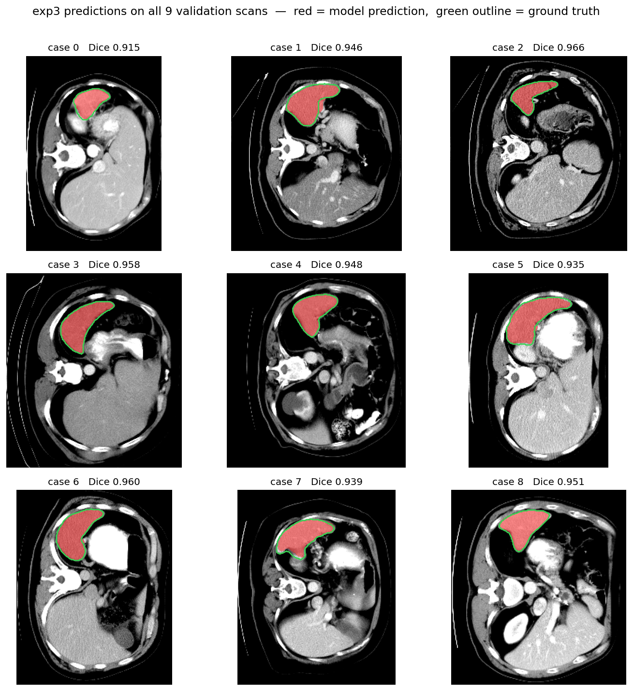
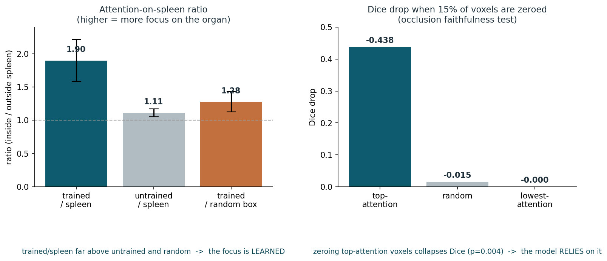
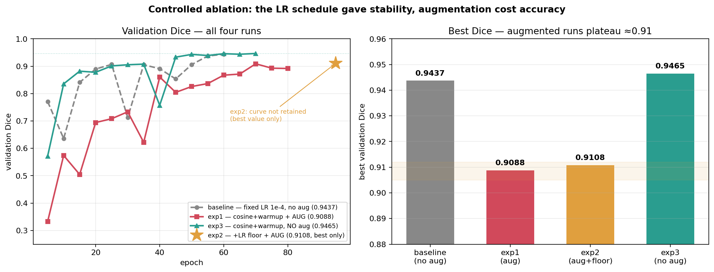
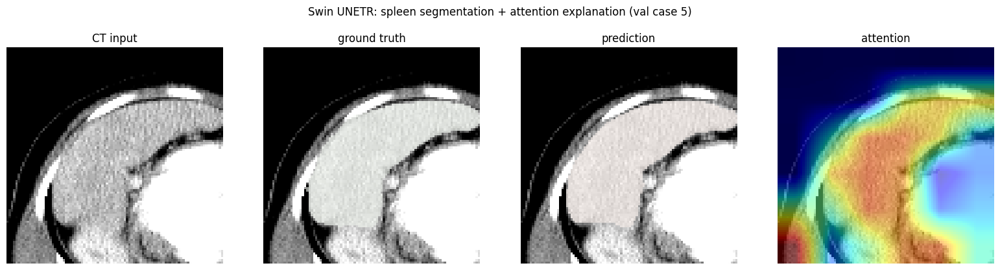

# Spleen Segmentation with Swin UNETR

Medical-image segmentation of the spleen from abdominal CT using a **Swin UNETR** vision transformer (PyTorch + MONAI), with **attention-based explainability** to verify the model looks at the right anatomy.

Final project for the **Neural Networks** course, Shenkar College of Engineering, Design and Art.
**Authors:** Ori Grossman & Amit Eliya.

---

## Overview

- Trained and evaluated a Swin UNETR model to segment the spleen from CT volumes (Medical Segmentation Decathlon, **Task09_Spleen**).
- Best validation **Dice 0.9465**.
- Ran a controlled, epoch-matched **ablation** isolating data augmentation.
- Built **attention-based explainability** and tested it for faithfulness (occlusion), not just correlation.

## Results

| Configuration | Val Dice |
|---|---|
| Baseline | 0.944 |
| + augmentation | 0.909 |
| + augmentation + Dice floor | 0.911 |
| **No augmentation (best)** | **0.9465** |

- **Epoch-matched control:** the augmented recipe at the same 70 epochs reached 0.8927 vs 0.9465 → augmentation *hurt* on this small (32-volume) CT set, even at a matched compute budget.
- **Boundary quality (best model):** HD95 3.95 mm · Surface-Dice 0.889 @2 mm · precision 0.944 · recall 0.950.
- **Stability:** 3-seed mean 0.9477 ± 0.0028; paired Wilcoxon vs the augmented recipe confirms the no-aug choice is the stable one.

## Explainability

Hooked the deepest Swin self-attention to see where the model attends:
- Attention concentrates on the spleen (attention-on-spleen ratio **1.47–2.33** across validation cases).
- **Null control:** a trained model's attention ratio (~1.90) is well above an untrained model (~1.11) and a random box (~1.28) → the concentration is *learned*.
- **Occlusion faithfulness:** masking the top-attention region drops Dice by **0.44**, vs **0.01** for random regions (Wilcoxon p = 0.004) → the attention is *faithful*, not merely correlational.

## Stack

PyTorch · MONAI 1.4.0 · Swin UNETR · trained on an NVIDIA L4 GPU.

## Repository

| Path | What it is |
|---|---|
| `Spleen_Segmentation_SwinUNETR.ipynb` | The full, self-contained notebook — code, outputs and figures. |
| `demo_inference.ipynb` | Short inference-only demo: loads the trained checkpoint, segments a validation volume, and reproduces the attention analysis in a few seconds. |
| `docs/Report.pdf` | Written technical report. |
| `docs/Presentation.pdf` | Project presentation slides. |
| `figures/` | Result figures (learning curves, ablation, attention maps, prediction gallery). |

## Data

The dataset is **not** included in this repo. See [`docs/DATA.md`](docs/DATA.md) to download the Medical Segmentation Decathlon **Task09_Spleen** volumes from the official source.

## Reproducing

The notebook was run on a university GPU lab and is committed **with all outputs saved**, so it reads end-to-end without re-running. To re-run, download the dataset (see `docs/DATA.md`) and use a CUDA GPU with MONAI + PyTorch.

## Selected figures

